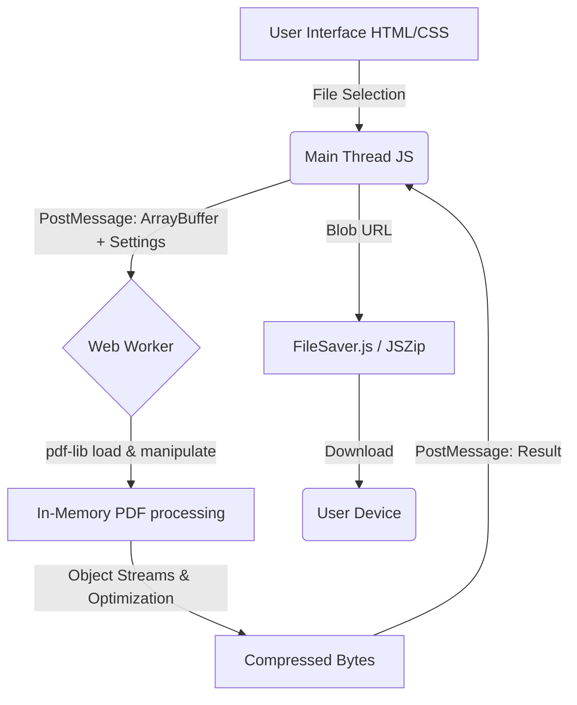

<div align="center">
  
  <h1 align="center">ZapPDF</h1>
  
  <p align="center">
    <strong>A blazing-fast, privacy-first universal file compressor. Natively compress PDFs, JPGs, RAW files, and more 100% locally in your browser using WebAssembly. No servers, no uploads.</strong>
    <br />
    <a href="https://github.com/abhranilsingharoy-cloud/ZapPDF/issues">Report Bug</a>
    ·
    <a href="https://github.com/abhranilsingharoy-cloud/ZapPDF/issues">Request Feature</a>
  </p>
</div>

<div align="center">
  
  
  
  
  
  
</div>

<div align="center">
  <code>pdf-compression</code> • <code>image-compression</code> • <code>client-side</code> • <code>webassembly</code> • <code>privacy-first</code> • <code>imagemagick</code>
</div>

---

## 📖 Table of Contents

- [About the Project](#-about-the-project)
- [Key Features](#-key-features)
- [Architecture & Security](#-architecture--security)
- [Getting Started](#-getting-started)
- [Usage Guide](#-usage-guide)
- [Roadmap](#-roadmap)
- [Contributing](#-contributing)
- [License](#-license)

## 🌟 About the Project

**ZapPDF** was born out of a simple necessity: *Compressing PDF and Image files without sacrificing privacy.* 

Most online compressors require users to upload their sensitive documents (invoices, legal contracts, personal IDs) to a remote server. This poses a significant security risk. ZapPDF revolutionizes this by leveraging modern Web APIs, WebAssembly, and powerful client-side libraries to perform all file processing **locally within your browser**.

It now natively supports PDF, JPG, PNG, SVG, TIFF, and PSD formats! Your files never leave your machine. No servers. No uploads. No limits.

## ✨ Key Features

- 🔒 **Absolute Privacy:** 100% client-side processing. Once you close the tab, your data vanishes.
- 🖼️ **Universal Format Support:** Natively compress PDFs, JPG, PNG, SVG, TIFF, PSD, RAW (CR2, NEF), and EPS directly in the browser using WebAssembly and `magick-wasm`.
- 📱 **Progressive Web App (PWA):** Fully installable on iOS and Android as a native-feeling app without app store downloads.
- ⚡ **Zero Latency:** Because there are no uploads or downloads to a server, compression begins instantly.
- 🤖 **ZapBot AI:** A built-in, context-aware AI assistant (powered by Gemini) available 24/7 to answer your questions.
- 🎯 **Smart Target Sizing:** Specify an exact target file size (e.g., 200KB) and the algorithm will attempt to hit it using advanced rasterization.
- 📦 **Batch Operations:** Drag, drop, and compress multiple files simultaneously, then download them bundled in a ZIP.
- 🛠️ **Granular Controls:** Strip metadata, flatten form fields, and adjust image DPI.
- 🎨 **Premium UI/UX:** A stunning "Golden Solar" dark-mode UI with glassmorphism effects, dynamic 3D floating background orbs, and confetti explosions upon successful compression!
- 📊 **Global Impact Tracker:** A local-storage tracker that calculates your lifetime bandwidth saved using the tool.

## 🏗️ Architecture & Security

ZapPDF utilizes a Web Worker architecture to prevent the main UI thread from blocking during heavy PDF manipulation tasks. 



**Security Guarantees:**
- **No API Calls:** The network tab remains entirely quiet during processing.
- **Stateless:** The application relies only on standard browser memory which is cleared upon tab closure.

## 🚀 Getting Started

To get a local copy up and running, follow these simple steps.

### Prerequisites

ZapPDF is a static frontend application. You simply need a local web server to serve the files (to bypass CORS/Worker restrictions that occur when opening `index.html` via the `file://` protocol).

*   Node.js (for `npx serve`) or Python (for `http.server`)

### Installation

1. **Clone the repository**
   ```sh
   git clone https://github.com/abhranilsingharoy-cloud/ZapPDF.git
   ```
2. **Navigate to the directory**
   ```sh
   cd ZapPDF
   ```
3. **Start a local development server**
   
   Using Node/npm:
   ```sh
   npx serve .
   ```
   Or using Python 3:
   ```sh
   python -m http.server 8000
   ```
4. **Open your browser**
   Navigate to `http://localhost:3000` (or `8000` depending on the server).

## 💡 Usage Guide

1. **Upload:** Drag and drop your PDF files into the designated drop zone.
2. **Configure:** Select a preset compression level (Low, Medium, High, Extreme) or toggle the advanced settings accordion to fine-tune metadata and DPI settings.
3. **Compress:** Click the "Compress" button. Watch the progress bar as the Web Worker processes your files in the background.
4. **Download:** Download files individually or click "Download All as ZIP" for batch downloads.

## 🗺️ Roadmap

- [x] Initial Release (UI/UX, core compression, batch processing)
- [x] Custom Target Size Rasterization
- [x] Universal Image Format Support (JPG, PNG, SVG, TIFF, PSD)
- [x] Gemini AI Chatbot Integration
- [ ] Implement OCR capabilities (via Tesseract.js)
- [ ] Add PDF merging and splitting utilities

## 🤝 Contributing

Contributions are what make the open-source community such an amazing place to learn, inspire, and create. Any contributions you make are **greatly appreciated**.

1. Fork the Project
2. Create your Feature Branch (`git checkout -b feature/AmazingFeature`)
3. Commit your Changes (`git commit -m 'Add some AmazingFeature'`)
4. Push to the Branch (`git push origin feature/AmazingFeature`)
5. Open a Pull Request

## 📄 License

Distributed under the MIT License. See `LICENSE` for more information.

---
<p align="center">Designed and Developed by Abhranil Singha Roy.</p>
