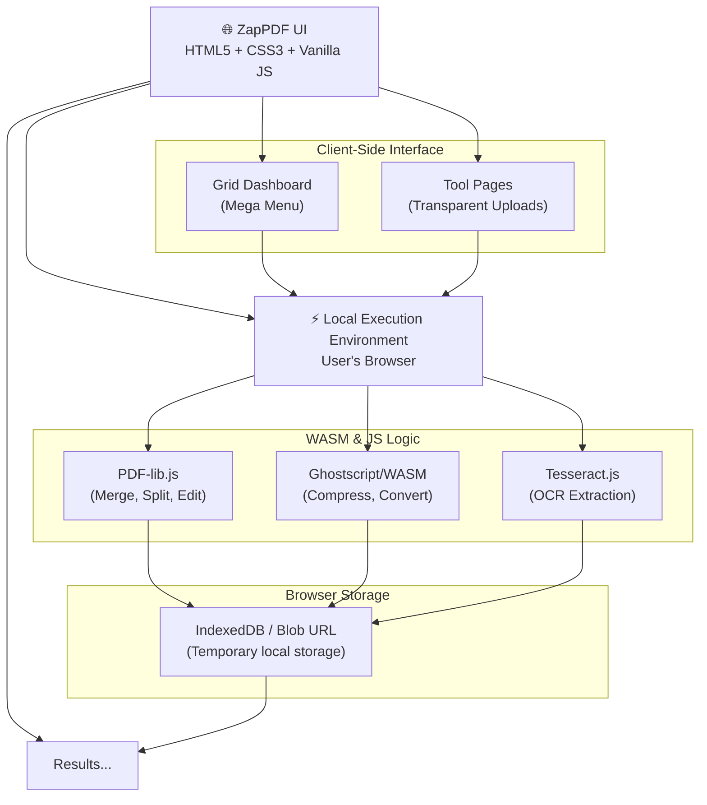

<div align="center">

<!-- Futuristic Decorative Header -->


<br/>

<!-- Badges -->
<p>
  
  
  
  
</p>

<p>
  
  
  
</p>

<br/>

> *"All the power of a premium PDF suite, without ever uploading your files to a server."*

<br/>

<p>
  <a href="#-about-the-project">About</a> &nbsp;·&nbsp;
  <a href="#-key-features">Features</a> &nbsp;·&nbsp;
  <a href="#-visual-architecture">Architecture</a> &nbsp;·&nbsp;
  <a href="#-how-it-works">How It Works</a> &nbsp;·&nbsp;
  <a href="#-installation">Installation</a>
</p>

<h3>🚀 <a href="http://localhost:3000">Try ZapPDF Locally</a></h3>

</div>

---

## ✦ About the Project

**ZapPDF** is a revolutionary, privacy-first PDF utility suite that mimics the intuitive, expansive grid experience of major platforms (like iLovePDF) but operates **entirely within your browser**. By leveraging advanced WebAssembly (WASM) and modern JavaScript APIs, ZapPDF ensures that your sensitive documents never leave your local machine.

Whether you're merging confidential financial reports, compressing heavy image-based PDFs, or securely unlocking and redacting documents, ZapPDF provides lightning-fast execution and absolute data privacy.

<br clear="right"/>

---

## ✦ Key Features

<table>
  <tr>
    <td width="50%">

### 🛠️ Core PDF Utilities
- **Compress PDF ⚡**: Drastically reduce the file size of your PDFs while maintaining extreme visual quality.
- **Merge & Split 🔗**: Combine dozens of PDFs into one master file, or extract individual pages effortlessly.
- **Organize & Rotate 🔀**: Reorder pages visually via drag-and-drop or fix upside-down pages with a single click.
- **Convert to/from PDF 🔄**: Comprehensive conversion tools supporting JPG, Word, Excel, PowerPoint, and HTML.

    </td>
    <td width="50%">

### 🔒 Security & Privacy
- **Zero-Server Processing**: 100% of the computation happens locally in your browser. No uploads, no cloud, no data retention.
- **Protect & Unlock PDF 🔑**: Encrypt files with robust passwords or strip protections from documents you own.
- **Permanent Redaction ⬛**: Visually scrub and permanently flatten sensitive information, removing it completely from the underlying text layers.
- **Digital Signatures ✍️**: Securely draw and stamp your signature onto any document without third-party tracking.

    </td>
  </tr>
  <tr>
    <td width="50%">

### 🧠 Advanced Tools & Intelligence
- **AI Summarizer 🤖**: Generate concise, actionable summaries from long-form articles and PDF essays.
- **Translate PDF 🌍**: Translate documents into any language while preserving the original layout and formatting.
- **OCR Text Extraction 👁️**: Extract selectable text from flat, scanned images or image-based PDFs.
- **PDF Forms 📋**: Detect fields and fill out interactive PDF forms locally.

    </td>
    <td width="50%">

### 🎨 Premium UI & Experience
- **Sleek iLovePDF-style Interface**: A familiar, gorgeous grid-based layout with a massive, organized Mega-Menu.
- **Dark Mode / Light Mode ☀️🌙**: Toggleable cinematic themes using a dynamic CSS variable system.
- **Transparent 3D Upload Zones**: Beautiful, highly-polished 3D cloud upload components on every tool page.
- **Responsive Mobile Design**: Perfect functionality and scaling on desktops, tablets, and smartphones.

    </td>
  </tr>
</table>

---

## ✦ Visual Architecture

Unlike traditional PDF editors that require heavy server-side processing, ZapPDF pushes the boundaries of modern browsers to keep your data local.


```mermaid
graph TD
    UI["🌐 ZapPDF UI<br>HTML5 + CSS3 + Vanilla JS"]
    
    subgraph Client ["Client-Side Interface"]
        direction LR
        G["Grid Dashboard<br>(Mega Menu)"]
        T["Tool Pages<br>(Transparent Uploads)"]
    end
    
    ENV["⚡ Local Execution Environment<br>User's Browser"]
    
    subgraph Logic ["WASM & JS Logic"]
        direction LR
        PDF["PDF-lib.js<br>(Merge, Split, Edit)"]
        Ghost["Ghostscript/WASM<br>(Compress, Convert)"]
        Tess["Tesseract.js<br>(OCR Extraction)"]
    end
    
    subgraph Storage ["Browser Storage"]
        IDB["IndexedDB / Blob URL<br>(Temporary local storage)"]
    end
    
    Res["Results..."]

    UI --> ENV
    UI --> G
    UI --> T
    UI --> Res
    
    G --> ENV
    T --> ENV
    
    ENV --> PDF
    ENV --> Ghost
    ENV --> Tess
    
    PDF --> IDB
    Ghost --> IDB
    Tess --> IDB
    
    IDB --> Res
```

---

## ✦ Architecture & Folder Structure

```text
📁 ZapPDF/
│
├── 📄 index.html                  ← Main Entry Point, Grid Dashboard & Compress Tool
├── 📄 package.json                ← Dependencies & build scripts (if any)
├── 📄 manifest.json               ← PWA Manifest for progressive web app support
├── 📄 README.md                   ← Project documentation
│
├── 📁 assets/                     ← Core Frontend Assets & Logic
│   │
│   ├── 📁 css/                    ← Modular Stylesheets
│   │   ├── 🎨 main.css            ← Global CSS Variables, Themes, Typography
│   │   ├── 🎨 navbar.css          ← Mega-menu, complex dropdowns & navigation
│   │   ├── 🎨 tool.css            ← 3D transparent upload zones & interactive UI
│   │   ├── 🎨 hero.css            ← Hero section animations & particle effects
│   │   ├── 🎨 sections.css        ← Grid layout for the 31+ tool cards
│   │   ├── 🎨 results.css         ← Progress bars, success states, download UI
│   │   ├── 🎨 chat.css            ← Prime AI Floating Chat Widget styles
│   │   └── 🎨 responsive.css      ← Mobile breakpoints and scaling rules
│   │
│   ├── 📁 js/                     ← Client-Side Logic & WebAssembly Interfaces
│   │   ├── ⚙️ main.js             ← Global UI state, event listeners, routing
│   │   ├── ⚡ compress.js         ← Ghostscript/WASM integration for compression
│   │   ├── 💾 db.js               ← IndexedDB / Blob URL local storage manager
│   │   ├── 🧠 worker.js           ← Web Workers for non-blocking heavy processing
│   │   ├── 📤 upload.js           ← Drag-and-drop mechanics & file validation
│   │   ├── 🌙 theme.js            ← Dark/Light mode toggle & persistence
│   │   ├── 💬 chat.js             ← Client-side AI Chatbot interactions
│   │   └── 📁 tools/              ← Individual modular scripts for specific tools
│   │
│   ├── 📁 icons/                  ← Custom SVG Iconography (Flags, Tools, UI)
│   └── 📁 img/                    ← Static image assets
│
└── 📁 tools/                      ← Individual Tool Pages (31+ Tools)
    ├── 📁 Organize/
    │   ├── merge.html             ← Combine multiple PDFs
    │   ├── split.html             ← Extract or split pages
    │   └── organize.html          ← Drag-and-drop page reordering
    │
    ├── 📁 Convert/
    │   ├── pdf-to-jpg.html        ← Extract images from PDF
    │   ├── word-to-pdf.html       ← DOCX to PDF conversion
    │   ├── excel-to-pdf.html      ← Spreadsheet to PDF conversion
    │   └── html-to-pdf.html       ← Web page to PDF conversion
    │
    ├── 📁 Security/
    │   ├── protect.html           ← Add AES encryption & passwords
    │   ├── unlock-pdf.html        ← Remove security restrictions
    │   └── redact.html            ← Permanently scrub text layers
    │
    ├── 📁 AI & Intelligence/
    │   ├── ai-summarizer.html     ← Generate summaries from long PDFs
    │   └── translate-pdf.html     ← Preserve layout while translating text
    │
    └── [... 18 more specific tools]
```

---

## ✦ How It Works

1. **Select a Tool**: Choose from over 30 distinct PDF utilities from the homepage grid or the top Mega-Menu.
2. **Drop Your Files**: Drag and drop your PDFs onto the beautifully crafted 3D transparent upload zone.
3. **Local Processing**: As soon as you hit execute, ZapPDF runs advanced JavaScript and WebAssembly libraries directly inside your browser tab to process the file. No network requests are made with your data.
4. **Instant Download**: The output file is generated locally as a Blob URL and downloaded instantly.

---

## ✦ Installation

Because ZapPDF is entirely client-side, it requires absolutely no complex backend setup or database configuration.

1. **Clone the repository:**
   ```bash
   git clone https://github.com/abhranilsingharoy-cloud/ZapPDF.git
   cd ZapPDF
   ```

2. **Serve locally:**
   You can use any simple HTTP server to serve the static files. For example, using Python:
   ```bash
   python -m http.server 3000
   ```

3. **Open your browser:**
   Navigate to `http://localhost:3000` to access the full suite!

---

## ✦ Credits

ZapPDF is maintained and developed as a premium, privacy-first alternative to commercial online PDF editors. Designed with a focus on intuitive user experience and absolute data security.
