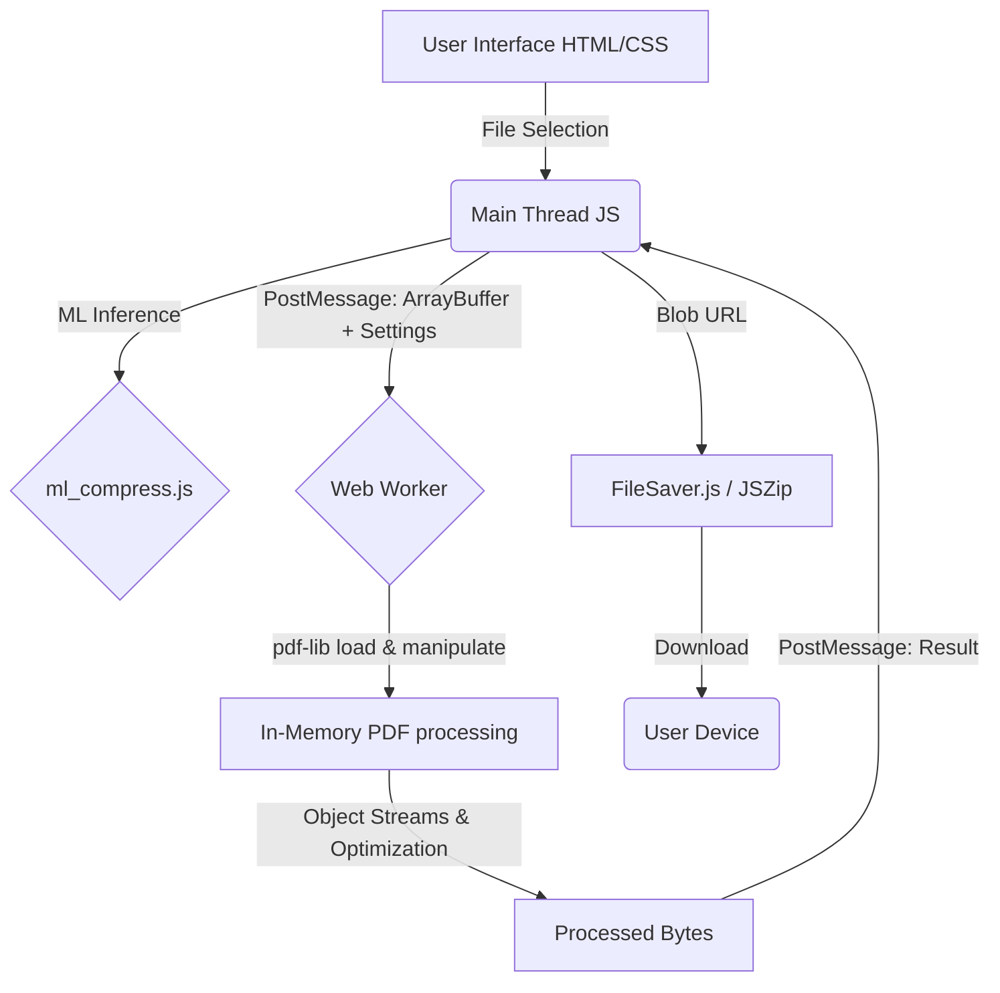

<div align="center">
  
  <h1 align="center">ZapPDF</h1>
  
  <p align="center">
    <strong>The Ultimate Privacy-First PDF Suite. Compress, edit, merge, and organize up to 100 files at once using our revolutionary All-In-One Studio Mode. 100% local processing via WebAssembly. No servers, no uploads.</strong>
    <br />
    <a href="https://github.com/abhranilsingharoy-cloud/ZapPDF/issues">Report Bug</a>
    ·
    <a href="https://github.com/abhranilsingharoy-cloud/ZapPDF/issues">Request Feature</a>
  </p>
</div>

<div align="center">
  
  
  
  
  
  
</div>

<div align="center">
  <code>pdf-compression</code> • <code>batch-processing</code> • <code>client-side</code> • <code>webassembly</code> • <code>privacy-first</code> • <code>imagemagick</code>
</div>

---

## 📖 Table of Contents

- [About the Project](#-about-the-project)
- [Key Features](#-key-features)
- [Architecture & Security](#-architecture--security)
- [Project Structure](#-project-structure)
- [Getting Started](#-getting-started)
- [Usage Guide](#-usage-guide)
- [Roadmap](#-roadmap)
- [Contributing](#-contributing)
- [License](#-license)

## 🌟 About the Project

**ZapPDF** is an advanced, privacy-first web application that revolutionizes document management by bringing a complete suite of professional PDF and image tools directly into your browser.

Traditionally, manipulating sensitive documents—such as legal contracts, financial invoices, or personal identification—required uploading files to external, third-party servers. This workflow introduces significant data security and privacy risks. ZapPDF eliminates this vulnerability entirely by leveraging modern Web APIs, WebAssembly, and client-side processing libraries to execute all operations **100% locally on your machine**.

### 🛠️ The ZapPDF Studio
Stop jumping between different web pages. With our revolutionary **All-In-One Studio Mode**, you can upload your document once and instantly switch between Compress, Edit, Watermark, and 12 other tools without ever downloading or re-uploading. Chain operations together sequentially in our massive new fullscreen workspace.

## ✨ Key Features

- **✨ ZapPDF Studio**: An All-In-One fullscreen workspace to chain multiple operations (compress, watermark, crop) without re-uploading.
- **📦 100-File Batch Processing**: Process up to 100 files simultaneously in parallel, packaged instantly into a downloadable `.zip`.
- **🔒 Absolute Privacy**: 100% client-side processing. Once you close the tab, your data vanishes.
- **🧠 ML Smart Compression:** Integrated local AI Decision Tree inference (`ml_compress.js`) that mathematically predicts the optimal `quality` and `scale` for PDF compression to perfectly hit custom target sizes without server latency.
- **🖼️ Ultimate Tool Ecosystem:** Not just a compressor! Natively includes:
  - **Merger & Splitter:** Stitch documents together or extract exact page ranges.
  - **Organize Pages:** Visually rearrange or delete specific pages.
  - **Redact Text:** Permanently obliterate sensitive information from your documents.
  - **Page Numbers:** Automatically stamp page numbers on every page.
  - **OCR Extraction:** Powered by `Tesseract.js` AI to extract raw copyable text from images and scanned PDFs.
  - **Password Protection:** AES-256 encryption to secure your PDFs.
  - **Format Converter:** Convert image formats to PDF and vice versa.
- **🌙 Light / Dark Theme**: A beautifully engineered dynamic theme toggle that respects system preferences and saves to `localStorage`.
- **📱 Progressive Web App (PWA):** Fully installable on iOS and Android as a native-feeling app without app store downloads.
- **⚡ Zero Latency:** Because there are no uploads or downloads to a server, processing begins instantly.
- **🤖 ZapBot AI:** A built-in, context-aware AI assistant (powered by Gemini) available 24/7 to answer your questions.

## 🏗️ Architecture & Security

ZapPDF utilizes a multi-page routing architecture and a Web Worker setup to prevent the main UI thread from blocking during heavy PDF manipulation tasks. 


```mermaid
graph TD
    A[User Interface HTML/CSS] -->|File Selection| B(Main Thread JS)
    B -->|ML Inference| C{ml_compress.js}
    B -->|PostMessage: ArrayBuffer + Settings| D{Web Worker}
    D -->|pdf-lib load & manipulate| E[In-Memory PDF processing]
    E -->|Object Streams & Optimization| F[Processed Bytes]
    F -->|PostMessage: Result| B
    B -->|Blob URL| G[FileSaver.js / JSZip]
    G -->|Download| H(User Device)
```

**Security Guarantees:**
- **No API Calls:** The network tab remains entirely quiet during processing.
- **Stateless:** The application relies only on standard browser memory which is cleared upon tab closure.

## 📁 Project Structure

```text
ZapPDF/
├── .github/                # Community & Security Guidelines
├── api/                    # Vercel Serverless Functions (Gemini AI)
├── tools/                  # PDF & Image Manipulation Apps
│   ├── studio.html         # All-In-One Workspace
│   ├── convert.html
│   ├── merge.html
│   └── ...
├── pages/                  # Legal & Informational Pages
├── assets/                 # Static Assets
│   ├── css/                # Stylesheets
│   ├── icons/              # SVG Icons
│   └── js/                 # Logic & WebAssembly modules
├── index.html              # Homepage
├── sw.js                   # Service Worker for PWA Offline Support
├── sitemap.xml             # SEO Sitemap
└── manifest.json           # PWA Manifest
```

## 🚀 Getting Started

To get a local copy up and running, follow these simple steps.

### Prerequisites

ZapPDF is a static frontend application. You simply need a local web server to serve the files (to bypass CORS/Worker restrictions that occur when opening `index.html` via the `file://` protocol).

*   Node.js (for `npx serve`) or Python (for `http.server`)

### Installation

1. **Clone the repository**
   ```sh
   git clone https://github.com/abhranilsingharoy-cloud/ZapPDF.git
   ```
2. **Navigate to the directory**
   ```sh
   cd ZapPDF
   ```
3. **Start a local development server**
   
   Using Node/npm:
   ```sh
   npx serve .
   ```
   Or using Python 3:
   ```sh
   python -m http.server 8000
   ```
4. **Open your browser**
   Navigate to `http://localhost:3000` (or `8000` depending on the server).

## 💡 Usage Guide

1. **Upload:** Drag and drop your PDF files into the designated drop zone. (Up to 100 files at once!)
2. **Configure:** Select a preset compression level (Low, Medium, High, Extreme) or jump into **ZapPDF Studio** to apply multiple tools.
3. **Process:** Click the action button. Watch the progress bar as the Web Worker processes your files natively in your browser.
4. **Download:** Download files individually or click "Download All as ZIP" for batch downloads.

## 🗺️ Roadmap

- [x] Initial Release (UI/UX, core compression)
- [x] Universal Image Format Support (JPG, PNG, SVG, TIFF, PSD)
- [x] Gemini AI Chatbot Integration
- [x] Implement OCR capabilities (via Tesseract.js)
- [x] Add PDF merging and splitting utilities
- [x] Add Watermarking and Encryption (AES-256)
- [x] Visual PDF Cropping & Edit PDF
- [x] Image Extraction to ZIP
- [x] **100-File Batch Processing**
- [x] **ZapPDF Studio Mode (All-In-One)**
- [x] **Light/Dark Theme Toggle**
- [x] **IndexedDB Recent Files History**

## 🤝 Contributing

Contributions are what make the open-source community such an amazing place to learn, inspire, and create. Any contributions you make are **greatly appreciated**.
See `CONTRIBUTING.md` for full details.

1. Fork the Project
2. Create your Feature Branch (`git checkout -b feature/AmazingFeature`)
3. Commit your Changes (`git commit -m 'Add some AmazingFeature'`)
4. Push to the Branch (`git push origin feature/AmazingFeature`)
5. Open a Pull Request

## 📄 License

Distributed under the MIT License. See `LICENSE` for more information.

---
<p align="center">Designed and Developed by Abhranil Singha Roy.</p>
